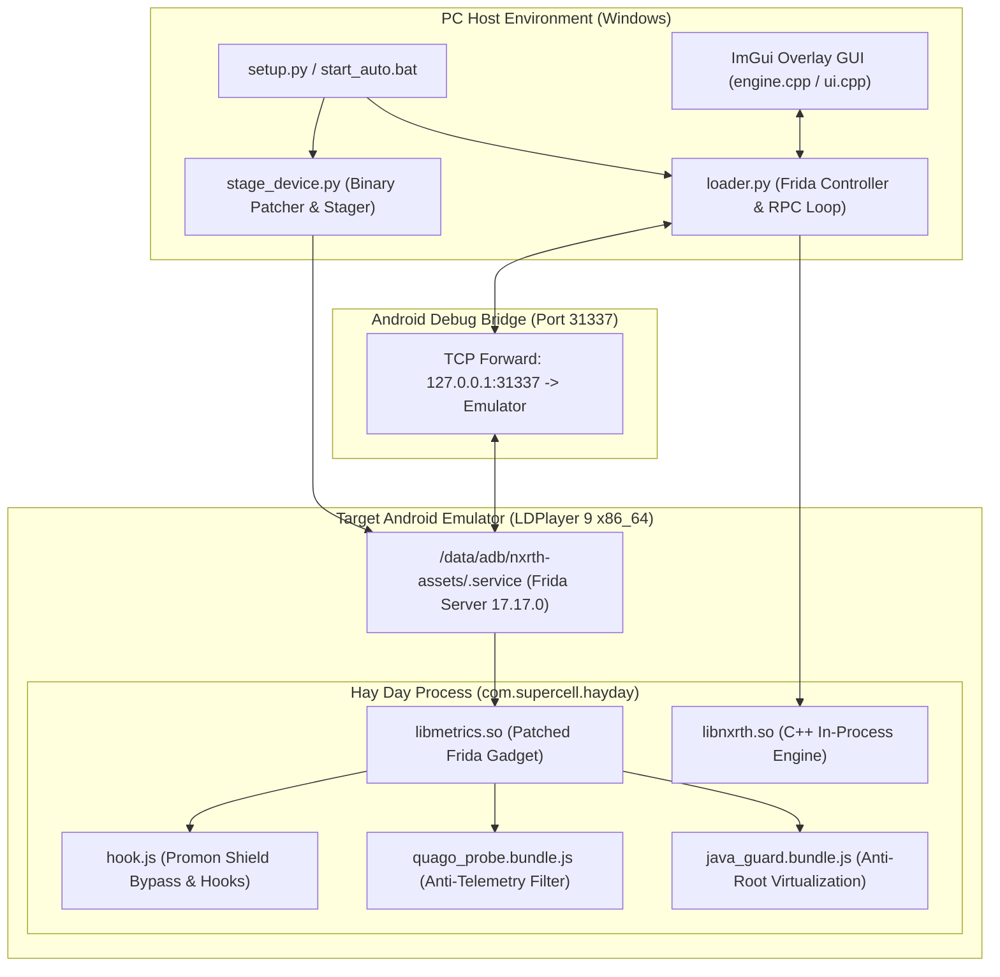

# inxernal — Private Core Developer & Architectural Guide

> **Confidential / Internal Developer Specification**  
> This repository contains the complete internal source code, reverse-engineering harness, native injection engine, and automated deployment pipelines for the `inxernal` automation suite.

---

## 🏛️ System Architecture



---

## 📦 Directory Structure & Component Map

| File / Folder | Role & Purpose |
|---|---|
| `loader.py` | Core host controller: manages ADB connections, injects runtime assets, provides interactive `nxrth>` CLI, and runs autonomous farming worker threads. |
| `stage_device.py` | Zero-touch asset staging pipeline: downloads official Frida binaries, applies signature patches, validates SHA-256 hashes, and stages assets to `/data/adb/nxrth-assets/`. |
| `setup.py` | Multi-stage environment validator and automatic launcher. Verifies Python, Frida, ADB, emulator root, and on-device binaries. |
| `start_auto.bat` / `ps1` | Double-click wrapper scripts for Windows and PowerShell. |
| `install.bat` / `ps1` | Hands-free installation scripts for non-technical end users. |
| `hook.js` | JavaScript Frida hooks for dynamic symbol resolution, Promon SHIELD bypasses, and in-game memory interceptors. |
| `quago_probe.ts` / `.bundle.js` | Quago behavioral anti-cheat interception probe; blocks telemetry uploads to `api.quago.io`. |
| `java_guard.ts` / `.bundle.js` | Android Java runtime virtualization layer hiding emulator artifacts and root markers. |
| `native/` | High-performance C++ native engine (`libnxrth.so`). Directly manipulates field data structures, executes farm routines, and controls memory offsets. |
| `engine.cpp` / `engine.h` | Direct memory scanning engine and native interface bindings for Windows ImGui frontend. |
| `ui.cpp` | Modern ImGui interface implementation with real-time field visualizer, farm automation controls, and diagnostics. |
| `tests/` | Reverse-engineering test suite, memory dump analyzers, and gadget patchers (`patch_gadget.py`). |
| `project-logs/` | Comprehensive session tracking logs (`work.md`, `decision.md`, `progress.md`, `extras.md`). |

---

## 🔬 Subsystem Deep Dive

### 1. Zero-Touch Binary Provisioning (`stage_device.py`)
To evade static hash and name detection without bloating Git repositories with >100MB binaries:
- Fetches official Frida Gadget 17.17.0 x86_64 (`.xz`), uncompresses it via `lzma`.
- Calls `tests/patch_gadget.py` to overwrite internal Frida signature strings (`frida:rpc`, `gum-js-loop`, etc.) with narrow null-safe markers.
- Verifies exact resulting SHA-256: `cfd21e76394bcf86481707754720c3d279016066e71aadeeef26d6ecdff4f981`.
- Stages Frida server as `/data/adb/nxrth-assets/.service` (chmod 755) and patched gadget as `libmetrics.so` (chmod 644).

### 2. Evasion Pipeline
- **Promon SHIELD:** Uses file-backed gadget injection rather than anonymous memfd mappings. Bypasses ptrace, debug registers, and memory checksum threads.
- **Quago Anti-Cheat:** Quago SDK collects device accelerometer, touch gestures, and frame intervals. `quago_probe.bundle.js` hooks the network layer and nullifies outgoing telemetry payloads, reporting fake 200 OK responses to the client engine.
- **Root & ABI Hiding:** `java_guard.bundle.js` intercepts Build properties (`Build.FINGERPRINT`, `Build.HARDWARE`, `Build.BOOTLOADER`) and masks `which su` executions.

### 3. Native Engine Execution (`libnxrth.so`)
The native engine is compiled as an ELF shared object (`x86_64`) loaded directly into the game's address space:
- Reads the static memory base of `libg.so`.
- Traverses dynamic field structs in the game heap.
- Triggers internal planting and harvesting virtual functions without relying on simulated mouse/touch clicks.
- Emits real-time state metrics back to `loader.py` over local socket RPC.

---

## 🛠️ Developer Build Instructions

### Building TypeScript Bundles
Prerequisites: Node.js 18+
```bash
npm install
npm run build
```
This re-bundles `quago_probe.ts` into `quago_probe.bundle.js` and `java_guard.ts` into `java_guard.bundle.js`.

### Building the Windows ImGui Overlay (`ui.cpp` / `engine.cpp`)
Prerequisites: Visual Studio 2022 (MSVC v143) with C++ Desktop Development.
- Open `inxernal.slnx` or `inxernal.vcxproj`.
- Select `Release | x64`.
- Build Solution (`Ctrl + Shift + B`).

### Compiling Native Engine (`libnxrth.so`)
Prerequisites: Android NDK r25+
```bash
cd native
cmake -B build -DCMAKE_TOOLCHAIN_FILE=$NDK/build/cmake/android.toolchain.cmake -DANDROID_ABI=x86_64 -DANDROID_PLATFORM=android-28
cmake --build build --config Release
```

---

## 🚀 Dual-Repository Workflow (Private ➔ Public)

To publish updates to both the Private core repository and the Public distribution repository:
1. Run `publish_to_github.bat` (or `python publish_to_github.py`).
2. The publisher will:
   - Synchronize full source, tests, and documentation to the **Private Repository**.
   - Strip development dumps and deploy sanitized release files to the **Public Repository**.
   - Guarantee both repositories remain up-to-date and fully documented.
